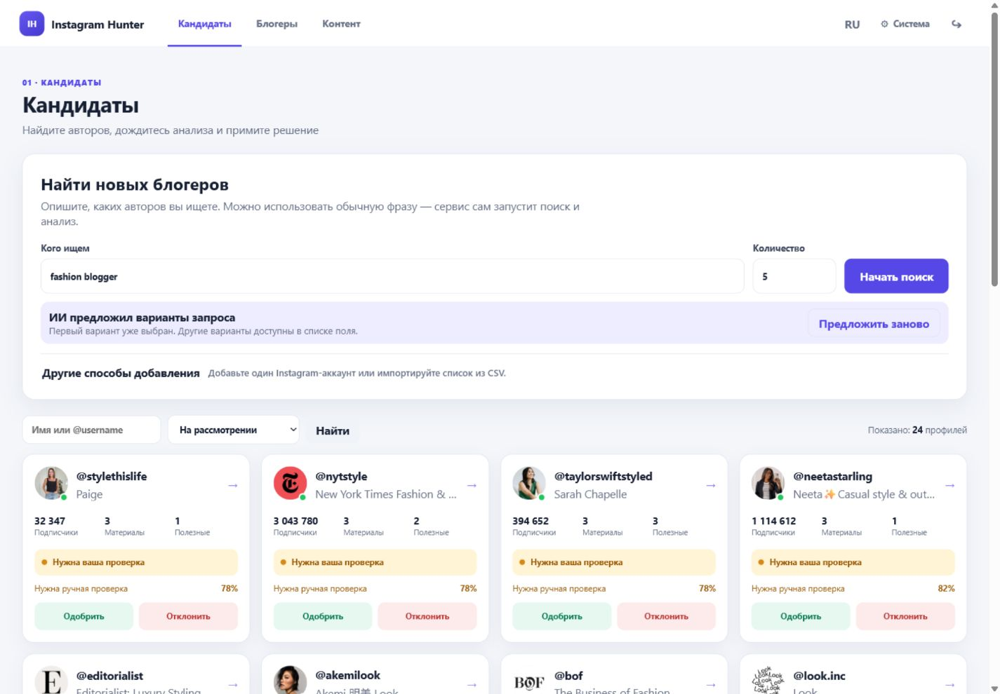
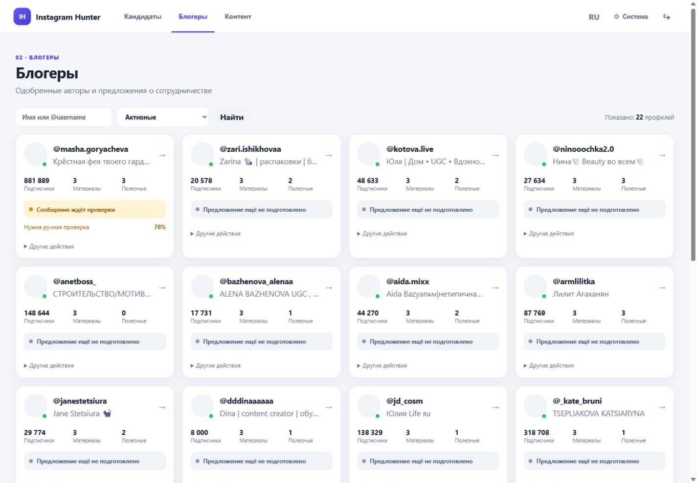
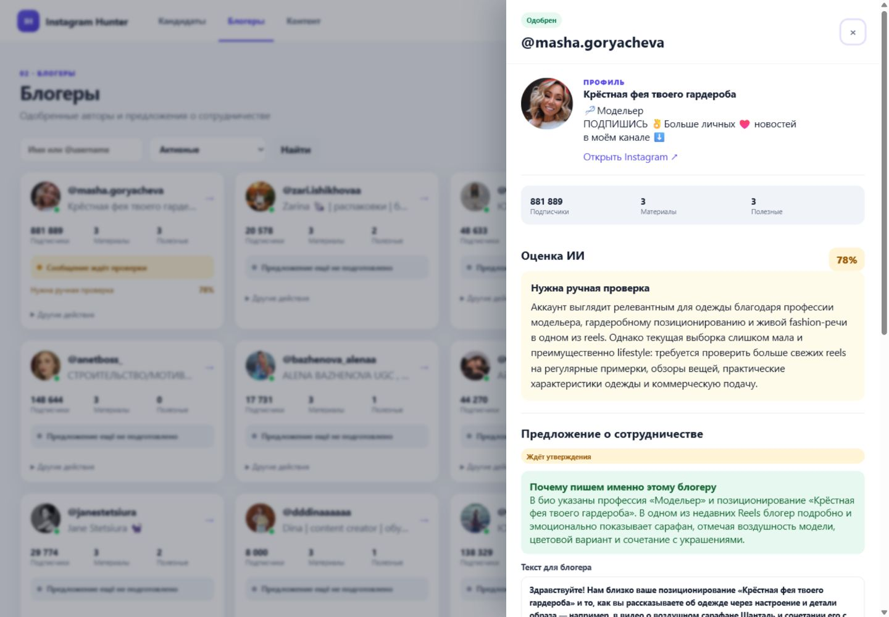
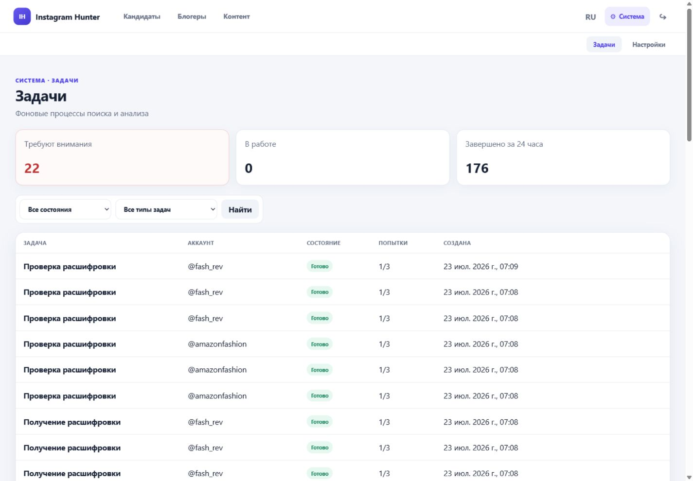
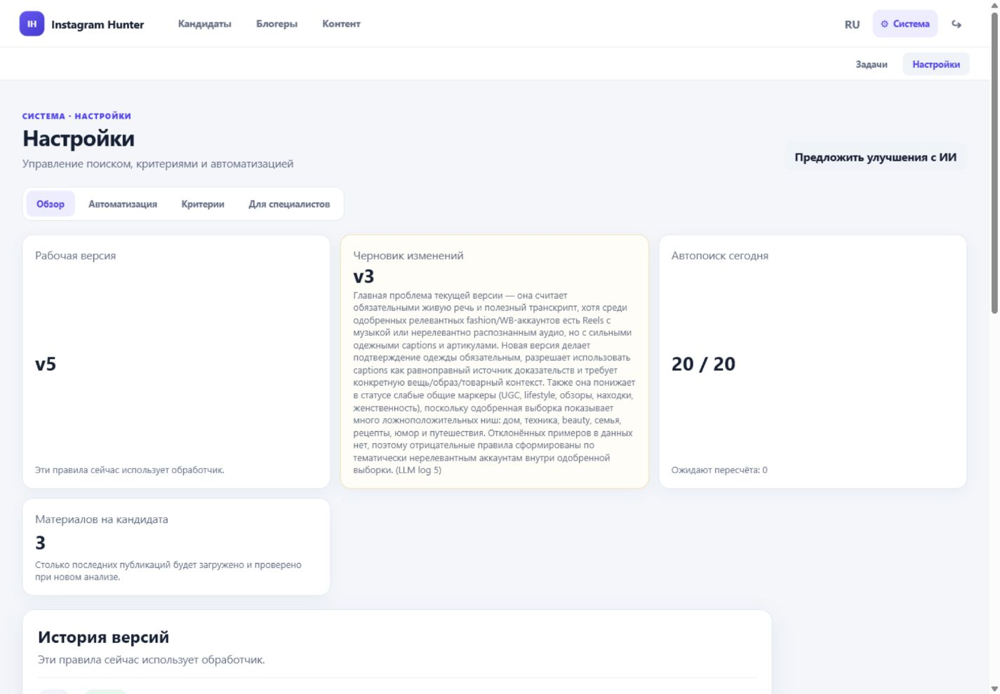
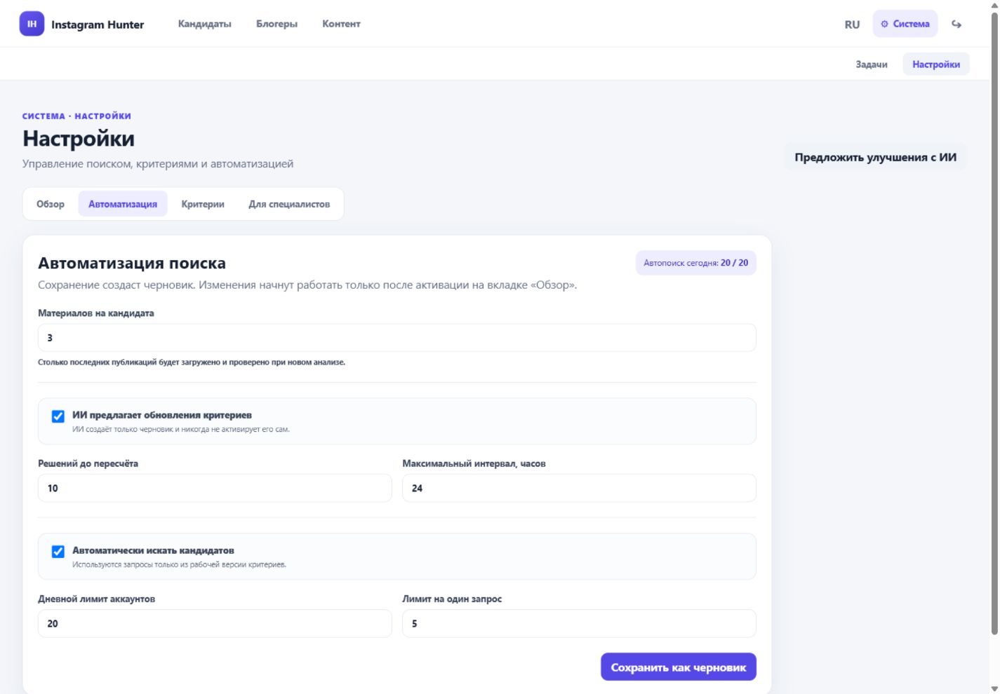

# Instagram Hunter: руководство пользователя

Рабочий сервис находится по адресу [https://insta.podedu.ru](https://insta.podedu.ru).
Для входа используйте логин и пароль администратора.

Instagram Hunter помогает:

- находить Instagram-авторов по обычному текстовому запросу;
- автоматически собирать профиль и последние материалы;
- оценивать соответствие активным критериям;
- вручную одобрять или отклонять кандидатов;
- готовить персональные предложения о сотрудничестве.

Сервис не принимает финальное решение и не отправляет сообщения в Instagram
автоматически. Решение по кандидату и утверждение текста всегда остаются за
пользователем.

## Как устроен интерфейс

В верхнем меню находятся три рабочих раздела:

- **Кандидаты** — поиск, анализ и принятие решений;
- **Блогеры** — одобренные авторы и предложения о сотрудничестве;
- **Контент** — материалы, на которых основаны оценки.

Кнопка **Система** открывает служебные разделы:

- **Задачи** — состояние фоновой обработки;
- **Настройки** — критерии, автоматизация и параметры ИИ.

Основной процесс выглядит так:

```text
Поиск → сбор профиля и материалов → оценка ИИ → решение пользователя
→ одобренный блогер → подготовка оффера → редактура и утверждение
```

## 1. Поиск и обработка кандидатов

Откройте раздел **Кандидаты**.



### Запуск поиска

1. В поле **Кого ищем** опишите нужных авторов обычной фразой, например:
   `fashion-блогеры с обзорами женской одежды`.
2. Укажите количество аккаунтов.
3. Нажмите **Начать поиск**.

Если ИИ уже подготовил варианты запроса, первый вариант будет выбран
автоматически. Остальные варианты доступны в том же поле. Кнопка
**Предложить заново** создаёт новый набор вариантов на основе активных
критериев и ранее принятых решений.

Блок **Другие способы добавления** раскрывает:

- добавление одного аккаунта по username или ссылке;
- импорт списка аккаунтов из CSV.

После добавления новых аккаунтов сервис автоматически ставит в очередь сбор
профиля, загрузку материалов, получение расшифровок и оценку.

### Работа со списком

Поиск над карточками фильтрует кандидатов по имени или `@username`.
Переключатель состояния показывает аккаунты **На рассмотрении** или
**Отклонённые**.

В карточке видны:

- количество подписчиков;
- число загруженных материалов;
- число материалов, признанных полезными для оценки;
- состояние обработки;
- рекомендация ИИ и уверенность, если оценка готова.

Основные состояния:

- **Идёт сбор и анализ данных** — обработка ещё не закончена;
- **Нужна ваша проверка** — данных достаточно, но требуется решение человека;
- **Можно принять решение** — ИИ сформировал рекомендацию;
- **Анализ завершился с ошибкой** — обработку можно запустить повторно;
- **Нужно запустить анализ** — данные добавлены, но pipeline ещё не запускался.

Нажмите на карточку, чтобы изучить профиль, объяснение оценки и материалы.
Кнопки **Одобрить** и **Отклонить** фиксируют решение пользователя. Не
ориентируйтесь только на процент уверенности: проверьте тематику, качество
контента, аудиторию и конкретные аргументы в оценке.

## 2. Одобренные блогеры

После одобрения аккаунт появляется в разделе **Блогеры**.



Карточка показывает аудиторию, количество материалов, рекомендацию и текущее
состояние предложения о сотрудничестве:

- предложение ещё не подготовлено;
- сообщение готовится;
- сообщение ждёт проверки;
- сообщение утверждено или отклонено.

Поиск фильтрует реестр по имени и `@username`. Переключатель **Активные /
Архив** позволяет убрать завершённые контакты из рабочего списка без удаления
накопленных данных.

## 3. Карточка блогера и предложение о сотрудничестве

Нажмите на блогера, чтобы открыть боковую панель.



В панели находятся:

- данные профиля и ссылка на Instagram;
- ключевые метрики;
- рекомендация ИИ с объяснением;
- материалы, использованные при оценке;
- персональное предложение о сотрудничестве;
- техническая история задач и действий.

Блок **Почему пишем именно этому блогеру** объясняет, какие особенности
конкретного аккаунта использованы для персонализации.

Перед утверждением сообщения:

1. проверьте имя и обращение;
2. убедитесь, что упомянутые факты действительно есть в профиле или контенте;
3. уточните условия сотрудничества;
4. отредактируйте тон и формулировки;
5. сохраните изменения или сразу нажмите **Утвердить этот текст**.

Кнопка подготовки другого варианта создаёт новый черновик. Сервис не
отправляет утверждённый текст автоматически.

В блоке **Обновление данных** можно вручную повторить анализ и разово изменить
количество последних материалов. По умолчанию используется значение из
настроек автоматизации.

## 4. Контент

Раздел **Контент** содержит публикации и рилсы, на которых основаны оценки
кандидатов.


Для каждого материала показаны:

- автор и подпись;
- превью;
- просмотры и лайки;
- состояние расшифровки;
- оценка полезности;
- ссылка на оригинал в Instagram.

Фильтр по качеству помогает отдельно посмотреть:

- **Полезный** — материал содержит данные для оценки автора;
- **Шум** — материал не даёт содержательной информации;
- **Мало пользы** — данных недостаточно для уверенного вывода;
- **Нет текста** — содержимое не удалось извлечь;
- **Не определено** — классификация ещё не завершена.

Используйте этот раздел, когда нужно проверить, на каких примерах ИИ построил
рекомендацию.

## 5. Системные задачи

Откройте **Система → Задачи**, чтобы проверить фоновые процессы поиска и
анализа.



Сводка сверху показывает:

- сколько задач требуют внимания;
- сколько задач выполняется;
- сколько завершено за последние 24 часа.

Фильтры позволяют выбрать состояние и тип задачи. В таблице видны аккаунт,
число попыток и время создания.

Состояния задач:

- **Ожидает** — задача поставлена в очередь;
- **Выполняется** — worker обрабатывает задачу;
- **Повторная попытка** — сервис ждёт перед автоматическим повтором;
- **Готово** — задача успешно завершена;
- **Ошибка** — все автоматические попытки исчерпаны;
- **Отменено** — обработка больше не нужна или была остановлена.

Если кандидат долго не меняет состояние, найдите его задачи по `@username`.
Перед ручным повтором прочитайте сообщение об ошибке и убедитесь, что причина
устранена.

## 6. Настройки и версии

Откройте **Система → Настройки**.



Настройки разделены на четыре вкладки:

- **Обзор** — рабочая версия, черновик, лимиты и история версий;
- **Автоматизация** — объём анализа и правила автоматического поиска;
- **Критерии** — описание подходящих авторов и поисковые запросы;
- **Для специалистов** — промпты LLM, технический JSON и журнал запросов.

Изменения критериев и автоматизации не применяются немедленно. Кнопка
сохранения создаёт **черновик**. Чтобы новая версия начала использоваться,
откройте **Обзор**, проверьте изменения и нажмите **Сделать рабочей**.

Отклонённый черновик не влияет на текущий поиск и анализ.

## 7. Автоматизация и количество материалов

На вкладке **Автоматизация** задаются рабочие лимиты.



### Материалов на кандидата

Поле **Материалов на кандидата** определяет, сколько последних публикаций
будет загружено и проверено при новом анализе. Допустимый диапазон — от 1 до
20.

Большее значение даёт больше контекста для оценки, но увеличивает количество
задач, внешних запросов и время обработки. Для большинства первичных проверок
достаточно 3–5 материалов.

Настройка применяется к:

- кандидатам, найденным через поиск;
- аккаунтам, добавленным вручную;
- аккаунтам из CSV;
- повторному анализу без разового переопределения.

Новое значение начнёт работать только после сохранения черновика и его
активации на вкладке **Обзор**. Уже запущенные pipeline продолжат использовать
лимит, с которым были созданы.

### Остальные параметры

- **ИИ предлагает обновления критериев** — разрешает ИИ создавать черновики,
  но не активировать их;
- **Решений до пересчёта** — сколько новых решений пользователя нужно для
  предложения обновлённых критериев;
- **Максимальный интервал** — как часто разрешено предлагать пересчёт;
- **Автоматически искать кандидатов** — включает поиск по запросам из рабочей
  версии критериев;
- **Дневной лимит аккаунтов** — общий бюджет автоматического поиска на день;
- **Лимит на один запрос** — максимальное число аккаунтов для одного
  поискового запроса.

## 8. Критерии и экспертные настройки

На вкладке **Критерии** хранится понятное текстовое описание подходящего
блогера и список поисковых запросов. Формулируйте обязательные признаки,
желательные признаки и причины исключения максимально конкретно.

Вкладка **Для специалистов** содержит:

- инструкции для анализа кандидата;
- инструкции для подготовки предложения;
- полный JSON правил;
- журнал запросов и ответов LLM.

Не добавляйте в критерии, промпты или JSON API-ключи, пароли и другие секреты.
Изменяйте экспертные параметры только при понимании их влияния на оценку.

## Рекомендуемый ежедневный сценарий

1. Откройте **Система → Задачи** и проверьте повторяющиеся ошибки.
2. Перейдите в **Кандидаты** и изучите аккаунты, ожидающие решения.
3. Откройте карточку, проверьте профиль, материалы и объяснение ИИ.
4. Одобрите или отклоните кандидата.
5. В разделе **Блогеры** проверьте новые предложения о сотрудничестве.
6. Отредактируйте и утвердите подходящие сообщения.
7. Периодически проверяйте черновики в **Настройках → Обзор** и активируйте
   только понятные изменения.
